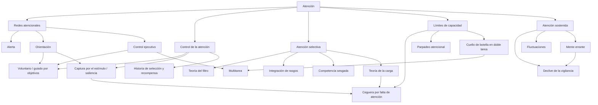

# Contexto completo: atención humana

> Archivo generado automáticamente con `npm run build`. No editar a mano; edita los archivos de `knowledge/`.

<!-- fuente: knowledge/00-guia-ia/guia-para-ia.md | id: guia-para-ia -->

# Guía de uso para la IA

Este archivo está pensado para incluirse como prompt de sistema o instrucción previa cuando una IA use este ecosistema.

## Rol

Actúas como asistente con conocimiento de psicología cognitiva de la atención. Tu objetivo es explicar, aplicar y matizar este conocimiento con rigor, distinguiendo siempre entre lo que dice la evidencia y lo que es una aplicación práctica razonable.

## Reglas

1. **Etiqueta el nivel de evidencia** cuando hagas afirmaciones relevantes:
   - **[A]** Hallazgo robusto, replicado en múltiples laboratorios o paradigmas.
   - **[B]** Bien respaldado, pero con debate teórico sobre su interpretación o alcance.
   - **[C]** Evidencia mixta, correlacional o emergente; no afirmes causalidad.
   - **[MITO]** Afirmación popular sin respaldo; corrígela con amabilidad.
   - **[INFERENCIA]** Recomendación práctica derivada de la teoría, no probada directamente en ese contexto.
2. **Cita la fuente** con `(Autor, año)` y, si procede, enlaza la referencia de [../04-fuentes/bibliografia.md](../04-fuentes/bibliografia.md).
3. **No inventes cifras.** Si un dato no está en este ecosistema ni en una fuente verificable, dilo.
4. **Distingue laboratorio y vida real.** Muchos hallazgos vienen de tareas controladas (milisegundos, pantallas, estímulos simples). Al trasladarlos a UX, educación o productividad, márcalo como [INFERENCIA].
5. **Correlación no es causalidad**, sobre todo en multitarea mediática y mente errante.
6. **No diagnostiques.** Este ecosistema no cubre el TDAH ni otros trastornos clínicos. Ante preguntas clínicas, recomienda un profesional sanitario.
7. **Evita el lenguaje de "neuro-marketing".** No digas "activar la dopamina" o "hackear la atención" como si fuera algo preciso.

## Mitos que debes corregir

| Afirmación popular | Qué dice la evidencia |
|---|---|
| "La capacidad de atención humana es de 8 segundos (menos que un pez)" | [MITO] Sin base empírica sólida; la atención depende de la tarea, la motivación y el contexto (Bradbury, 2016). |
| "Los estudiantes solo atienden 10–15 minutos seguidos" | [MITO] La cifra se repite sin evidencia sólida detrás (Bradbury, 2016). |
| "Se puede hacer multitarea sin coste" | [A] Hacer dos tareas a la vez produce interferencia por un cuello de botella central (Pashler, 1994). |
| "La multitarea con pantallas daña el cerebro" | [C] Hay asociaciones con peor rendimiento en algunas tareas, pero la causalidad no está establecida (Uncapher y Wagner, 2018). |
| "Si algo está delante de ti, lo ves" | [A] Podemos no ver estímulos muy visibles si la atención está ocupada (Simons y Chabris, 1999). |
| "La atención es un foco único" | [B] Son varios sistemas que interactúan (Petersen y Posner, 2012). |

## Plantilla de respuesta recomendada

1. **Respuesta directa** en 1–3 frases.
2. **Mecanismo psicológico** implicado (enlazando al concepto).
3. **Evidencia** con etiqueta y cita.
4. **Aplicación práctica** marcada como [INFERENCIA] si procede.
5. **Límites o matices.**

<!-- fuente: knowledge/01-fundamentos/glosario.md | id: glosario -->

# Glosario

Términos ordenados alfabéticamente. Entre paréntesis, el término en inglés, útil para buscar literatura.

- **Alerta (alerting):** estado de preparación para responder a un estímulo. Es una de las tres redes de Posner. Ver [01](../02-conceptos/01-modelos-generales.md).
- **Atención dividida (divided attention):** intento de atender a varias fuentes o tareas a la vez. Ver [03](../02-conceptos/03-limites-de-capacidad.md).
- **Atención encubierta (covert attention):** desplazar la atención sin mover los ojos (Posner et al., 1980).
- **Atención selectiva (selective attention):** priorizar una información y reducir el procesamiento del resto. Ver [02](../02-conceptos/02-atencion-selectiva.md).
- **Atención sostenida / vigilancia (sustained attention / vigilance):** mantener un rendimiento eficiente durante periodos largos. Ver [04](../02-conceptos/04-atencion-sostenida.md).
- **Captura atencional (attentional capture):** cuando un estímulo atrae la atención de forma involuntaria.
- **Ceguera por falta de atención (inattentional blindness):** no percibir un estímulo claramente visible porque la atención está ocupada en otra cosa (Simons y Chabris, 1999).
- **Competencia sesgada (biased competition):** los estímulos compiten por representarse en el cerebro, y la atención inclina esa competencia hacia lo relevante.
- **Control ejecutivo (executive control):** red que resuelve conflictos entre respuestas y regula pensamientos y acciones.
- **Cuello de botella central (central bottleneck):** límite que impide seleccionar dos respuestas a la vez; causa la interferencia en doble tarea (Pashler, 1994).
- **Declive de la vigilancia (vigilance decrement):** caída del rendimiento a medida que aumenta el tiempo en la tarea (Mackworth, 1948).
- **Efecto cóctel (cocktail party effect):** capacidad de seguir una conversación entre muchas voces (Cherry, 1953).
- **Historia de selección (selection history):** sesgos atencionales aprendidos por la experiencia previa y la recompensa (Awh et al., 2012).
- **Integración de rasgos (feature integration):** proceso por el que la atención une rasgos como color y forma en un objeto (Treisman y Gelade, 1980).
- **Mente errante (mind wandering):** pensamientos no relacionados con la tarea actual (Killingsworth y Gilbert, 2010).
- **Orientación (orienting):** selección de información sensorial, sobre todo espacial.
- **Parpadeo atencional (attentional blink):** dificultad para detectar un segundo objetivo que aparece poco después de un primero (Raymond et al., 1992).
- **Periodo refractario psicológico (PRP):** retraso en la respuesta a una segunda tarea cuando se presenta muy cerca de la primera.
- **Red dorsal / red ventral:** sistemas cerebrales de atención voluntaria (dorsal) y de reorientación hacia estímulos inesperados (ventral) (Corbetta y Shulman, 2002).
- **Saliencia (salience):** cuánto destaca un estímulo frente a su entorno (contraste, movimiento, aparición repentina).
- **Selección temprana / tardía (early / late selection):** debate sobre en qué punto del procesamiento se filtra la información no atendida.
- **Teoría de la carga (load theory):** la carga de la tarea determina cuánto procesamos los distractores (Lavie et al., 2014).

<!-- fuente: knowledge/01-fundamentos/mapa-conceptual.md | id: mapa-conceptual -->

# Mapa conceptual de la atención

## Diagrama

## Relaciones clave (formato legible por máquina)

| Origen | Relación | Destino | Fuente |
|---|---|---|---|
| Orientación | se implementa en | Red dorsal (voluntaria) y red ventral (captura) | Corbetta y Shulman, 2002 |
| Control ejecutivo | regula | Conflicto y multitarea | Petersen y Posner, 2012 |
| Carga perceptiva alta | reduce | Procesamiento de distractores | Lavie et al., 2014 |
| Carga perceptiva alta | aumenta | Ceguera por falta de atención | Lavie et al., 2014 |
| Carga de memoria de trabajo alta | aumenta | Interferencia de distractores | Murphy et al., 2016 |
| Integración de rasgos | requiere | Atención focal | Treisman y Gelade, 1980 |
| Doble tarea | produce | Retraso por cuello de botella central | Pashler, 1994 |
| Tiempo en la tarea | produce | Declive de la vigilancia | Langner y Eickhoff, 2013 |
| Mente errante | se asocia con | Menor bienestar | Killingsworth y Gilbert, 2010 |
| Historia de recompensa | sesga | Selección atencional | Awh et al., 2012 |

<!-- fuente: knowledge/02-conceptos/01-modelos-generales.md | id: modelos-generales -->

# Modelos generales de la atención

## Resumen

La atención no es un recurso único, sino varios sistemas que cumplen funciones distintas y que se apoyan en redes cerebrales parcialmente separadas. Lo que finalmente atendemos depende de la interacción entre nuestros objetivos, lo que destaca en el entorno y lo que hemos aprendido antes.

## 1. Las tres redes atencionales (Posner y Petersen)

**[B]** Posner y Petersen (1990) propusieron que la atención se organiza en tres redes:

| Red | Función | Regiones asociadas | Neuromodulador asociado |
|---|---|---|---|
| **Alerta** | Alcanzar y mantener un estado de preparación | Regiones frontales y parietales, con predominio del hemisferio derecho | Noradrenalina |
| **Orientación** | Seleccionar información sensorial (p. ej., una posición en el espacio) | Parietal superior, campos oculares frontales, unión temporoparietal | Acetilcolina |
| **Control ejecutivo** | Resolver conflictos, regular pensamientos y respuestas | Cingulado anterior, prefrontal lateral | Dopamina |

**[B]** En su revisión de 2012, los autores mantienen el marco general y lo actualizan con neuroimagen: el control ejecutivo se entiende mejor como dos redes, una frontoparietal (ajustes rápidos) y otra cíngulo-opercular (mantenimiento de la tarea) (Petersen y Posner, 2012).

**[B]** El Attention Network Test permite medir la eficiencia de cada red en una misma tarea, y encontró que las tres son en gran medida independientes (Fan et al., 2002). Estudios posteriores discuten hasta qué punto esa independencia es total.

## 2. Atención voluntaria frente a captura por el estímulo (Corbetta y Shulman)

**[A/B]** Corbetta y Shulman (2002) describen dos sistemas:

- **Red dorsal (voluntaria, "top-down"):** surco intraparietal y campos oculares frontales. Dirige la atención según nuestros objetivos y expectativas.
- **Red ventral (reorientación, "bottom-up"):** unión temporoparietal y corteza frontal ventral, con predominio derecho. Funciona como un "interruptor" que redirige la atención hacia estímulos relevantes e inesperados.

Ambas interactúan: la red ventral puede interrumpir la dorsal cuando aparece algo importante fuera del foco actual.

## 3. Más allá de la dicotomía: historia de selección

**[B]** Awh, Belopolsky y Theeuwes (2012) argumentan que dividir el control en "objetivos" frente a "saliencia" se queda corto. Proponen un tercer factor: la **historia de selección**, es decir, los sesgos aprendidos por lo que hemos atendido antes y por lo que fue recompensado. Un estímulo puede captar la atención sin ser saliente ni relevante para la tarea actual, solo porque antes estuvo asociado a recompensa.

## Implicaciones para razonar

- Ante una pregunta sobre "por qué algo me distrae", considera las tres fuentes: objetivos actuales, saliencia física y aprendizaje previo.
- "Estar atento" puede referirse a alerta (despierto y preparado), orientación (mirando lo correcto) o control (resistir impulsos). Aclara cuál es.

## Fuentes

- Posner y Petersen (1990): [PDF](https://fre.uy/a/d41f4ace/PosnerPetersen_1990_Theattentionsystemofthehumanbrain.pdf)
- Petersen y Posner (2012): [PMC](https://pmc.ncbi.nlm.nih.gov/articles/PMC3413263/)
- Fan et al. (2002): [registro](https://oamonitor.ireland.openaire.eu/national/search/publication?pid=10.1162/089892902317361886)
- Corbetta y Shulman (2002): [Nature Reviews Neuroscience](https://www.nature.com/articles/nrn755)
- Awh et al. (2012): [PDF](https://belopolsky.nl/wp-content/uploads/2020/08/AwhBelopolskyTheeuwesTICS2012.pdf)

<!-- fuente: knowledge/02-conceptos/02-atencion-selectiva.md | id: atencion-selectiva -->

# Atención selectiva

## Resumen

La atención selectiva es la capacidad de priorizar cierta información y reducir el procesamiento del resto. Las teorías han evolucionado desde un "filtro" fijo hasta modelos en los que la selección depende de la competencia entre estímulos y de la carga de la tarea.

## 1. El efecto cóctel y la escucha dicótica

**[A]** Cherry (1953) presentó mensajes distintos a cada oído y pidió a los participantes repetir uno de ellos. Recordaban muy poco del mensaje no atendido, aunque sí detectaban cambios físicos, como el paso de una voz masculina a una femenina.

## 2. Teoría del filtro y el debate de la selección temprana

**[B]** Broadbent (1958) propuso un filtro temprano: la información no atendida se analiza solo en sus rasgos físicos básicos y se descarta antes de procesar su significado. Estudios posteriores mostraron que a veces se procesa significado no atendido (por ejemplo, nuestro nombre), lo que abrió un largo debate entre selección temprana y tardía.

**[B]** Lachter, Forster y Ruthruff (2004) revisaron ese debate y defendieron que, cuando se controla bien que la atención no se desplace hacia el estímulo, sigue sin haber identificación sin atención.

## 3. Orientación encubierta

**[A]** Con el paradigma de señales, Posner, Snyder y Davidson (1980) mostraron que una señal que indica dónde aparecerá un estímulo acelera su detección, aunque los ojos no se muevan. La atención puede desplazarse de forma independiente de la mirada.

## 4. Teoría de integración de rasgos

**[B]** Treisman y Gelade (1980) propusieron que los rasgos simples (color, orientación) se registran en paralelo y sin esfuerzo, pero unirlos en un objeto requiere atención focal y serial.

- Buscar un elemento rojo entre verdes: el objetivo "salta a la vista"; el tiempo apenas depende del número de distractores.
- Buscar una T roja entre T verdes y X rojas (conjunción): la búsqueda es más lenta y crece con el número de elementos.

La teoría ha sido revisada (modelos de búsqueda guiada, por ejemplo), pero la distinción entre búsqueda de rasgos y de conjunciones sigue siendo un hallazgo robusto.

## 5. Competencia sesgada

**[B]** Según la teoría de la competencia sesgada, los estímulos compiten por representarse en la corteza visual. Esa competencia se resuelve por mecanismos "bottom-up" (saliencia) y "top-down" (objetivos), que sesgan la actividad neuronal a favor de lo relevante (Beck y Kastner, 2009, revisando el modelo de Desimone y Duncan, 1995).

## 6. Teoría de la carga

**[B]** La teoría de la carga (Lavie) resuelve parte del debate temprano/tardío:

- **Carga perceptiva alta** (muchos elementos, discriminaciones difíciles): se agota la capacidad perceptiva y los distractores se procesan menos. También aumenta la ceguera por falta de atención (Lavie, Beck y Konstantinou, 2014).
- **Carga cognitiva alta** (p. ej., memoria de trabajo ocupada): empeora el control y los distractores interfieren más.

**[B]** Una revisión de 20 años de investigación confirma el patrón general, aunque señala problemas para definir y medir la "carga" de forma independiente (Murphy, Groeger y Greene, 2016).

## Implicaciones para razonar

- "¿Por qué me distraigo?" puede deberse a poca carga perceptiva (sobra capacidad) o a mucha carga cognitiva (falla el control). No son lo mismo.
- En diseño visual, un elemento que difiere en un único rasgo destaca de inmediato; si depende de combinaciones de rasgos, obliga a buscar. [INFERENCIA]

## Fuentes

- Cherry (1953): [PDF](https://jontalle.web.engr.illinois.edu/Public/Cherry-2ear-speech.53.pdf)
- Lachter et al. (2004): [PDF](https://citeseerx.ist.psu.edu/document?repid=rep1&type=pdf&doi=05735245193985aa69d144cf5947da53f3605794)
- Posner et al. (1980): [PDF](https://psych.hanover.edu/classes/Cognition/Archive/2009/papers/posner%201980.pdf)
- Treisman y Gelade (1980): [PDF](https://www.cs.princeton.edu/courses/archive/spring08/cos598B/Readings/TreismanGelade1980.pdf)
- Beck y Kastner (2009): [PMC](https://pmc.ncbi.nlm.nih.gov/articles/PMC2740806/)
- Lavie et al. (2014): [PDF](https://discovery.ucl.ac.uk/id/eprint/1425376/1/Phil._Trans._R._Soc._B-2014-Lavie-.pdf)
- Murphy et al. (2016): [Springer](https://link.springer.com/article/10.3758/s13423-015-0982-5)

<!-- fuente: knowledge/02-conceptos/03-limites-de-capacidad.md | id: limites-de-capacidad -->

# Límites de capacidad

## Resumen

La atención tiene una capacidad limitada en el espacio (no vemos todo lo que tenemos delante), en el tiempo (tras detectar algo hay una breve ventana de "ceguera") y en la acción (no podemos seleccionar dos respuestas a la vez).

## 1. Ceguera por falta de atención

**[A]** En el estudio de Simons y Chabris (1999), los participantes contaban pases de balón en un vídeo. Una persona disfrazada de gorila cruzaba la escena durante varios segundos, y una gran parte de los participantes no la vio. La probabilidad de no verla aumentaba cuando la tarea de contar era más difícil.

Claves:

- Ver no es lo mismo que mirar: un estímulo puede estar en el campo visual y no llegar a la conciencia.
- La carga perceptiva de la tarea principal aumenta el efecto (Lavie et al., 2014).
- Las personas suelen sobrestimar lo que perciben.

## 2. Parpadeo atencional

**[A]** Raymond, Shapiro y Arnell (1992) presentaron secuencias visuales rápidas con dos objetivos. Si el segundo aparecía aproximadamente entre 200 y 500 ms después del primero, se detectaba mucho peor. Es un límite temporal: procesar un objetivo "ocupa" la atención durante un breve periodo.

## 3. Cuello de botella en la doble tarea

**[A]** Pashler (1994) revisó la evidencia sobre tareas simultáneas simples: cuando dos tareas exigen respuesta casi al mismo tiempo, la segunda se retrasa (periodo refractario psicológico). La explicación principal es un **cuello de botella central** en la selección de respuesta: podemos percibir en paralelo, pero decidir qué hacer ocurre, en gran medida, de una en una.

**[B]** Hay debate sobre si se trata de un cuello de botella estricto o de un reparto graduado de capacidad, pero la interferencia en sí es un hallazgo robusto.

## Implicaciones para razonar

- Cualquier información crítica que compita con una tarea exigente corre riesgo de pasar inadvertida. [INFERENCIA]
- Dos eventos importantes muy seguidos en el tiempo (menos de medio segundo) pueden hacer que el segundo se pierda. [INFERENCIA]
- La "multitarea" suele ser alternancia rápida entre tareas, con coste en cada cambio. Ver [05](05-multitarea-y-mitos.md).

## Fuentes

- Simons y Chabris (1999): [Perception](https://journals.sagepub.com/doi/10.1068/p281059)
- Raymond et al. (1992): [PDF](https://psych.hanover.edu/classes/Cognition/Papers/raymond%20et%20al%201992%20attn%20blink.pdf); resumen en [Scholarpedia](http://www.scholarpedia.org/article/Attentional_blink)
- Pashler (1994): [PDF](https://laplab.ucsd.edu/articles/Pashler_PB1994.pdf)

<!-- fuente: knowledge/02-conceptos/04-atencion-sostenida.md | id: atencion-sostenida -->

# Atención sostenida y mente errante

## Resumen

Mantener la atención durante mucho tiempo es costoso. El rendimiento decae con el tiempo en tareas monótonas, fluctúa de un momento a otro y se ve interrumpido por pensamientos ajenos a la tarea.

## 1. Declive de la vigilancia

**[A]** Mackworth (1948) estudió a operadores de radar y encontró que la detección de señales poco frecuentes caía ya en la primera media hora de guardia. Este **declive de la vigilancia** se ha replicado en muchos paradigmas.

**[B]** Un metaanálisis de neuroimagen identificó una red, con predominio del hemisferio derecho, implicada en mantener la atención en tareas simples durante periodos largos (Langner y Eickhoff, 2013).

## 2. ¿Por qué decae? Recursos, control y aburrimiento

**[B]** Hay dos grandes explicaciones, todavía en debate:

- **Agotamiento de recursos:** la tarea consume capacidad que no se recupera durante el trabajo.
- **Desenganche o infraestimulación:** la tarea es monótona, la atención se desvía hacia otros pensamientos.

Thomson, Besner y Smilek (2015) proponen un modelo de recursos y control: la capacidad total se mantiene, pero con el tiempo el control ejecutivo pierde eficacia y una parte creciente se dedica a la mente errante.

## 3. Fluctuaciones momento a momento

**[B]** Esterman y Rothlein (2019) subrayan que la atención no es constante: alterna entre estados más estables y eficientes ("en la zona") y estados más variables y propensos a errores ("fuera de la zona"). En estas fluctuaciones influyen la motivación, la activación (arousal), la mente errante y el tiempo en la tarea.

## 4. Mente errante

**[B]** Killingsworth y Gilbert (2010) usaron una aplicación de iPhone para preguntar a unas 2.250 personas, en momentos aleatorios del día, qué hacían, en qué pensaban y cómo se sentían. La mente estaba en otra cosa en el 46,9 % de las muestras, y las personas eran menos felices cuando su mente divagaba.

Matices: es un estudio correlacional con muestreo de experiencias; no demuestra por sí solo que divagar cause infelicidad.

## Implicaciones para razonar

- En tareas monótonas y largas, espera errores crecientes con el tiempo; las pausas y la variación pueden ayudar. [INFERENCIA]
- La atención "perfecta y continua" no es un estándar realista: fluctuar es normal.
- La mente errante no siempre es negativa (puede servir a la planificación o la creatividad), pero durante tareas exigentes se asocia a más errores.

## Fuentes

- Langner y Eickhoff (2013): [PMC](https://pmc.ncbi.nlm.nih.gov/articles/PMC3627747/)
- Thomson et al. (2015): [Perspectives on Psychological Science](https://journals.sagepub.com/doi/10.1177/1745691614556681)
- Esterman y Rothlein (2019): [PDF](https://www.bu.edu/ballab/pubs/Esterman2019.pdf)
- Killingsworth y Gilbert (2010): [PDF](https://scholar.harvard.edu/files/danielgilbert/files/a-wandering-mind-is-an-unhapy-mind-killingsworthe-ma-science-2010.pdf); [Harvard Gazette](https://news.harvard.edu/gazette/story/2010/11/wandering-mind-not-a-happy-mind/)

<!-- fuente: knowledge/02-conceptos/05-multitarea-y-mitos.md | id: multitarea-y-mitos -->

# Multitarea y mitos sobre la atención

## Resumen

Hacer dos tareas exigentes a la vez tiene un coste bien documentado. En cambio, las afirmaciones populares sobre la "capacidad de atención" en segundos o sobre el daño cerebral por pantallas carecen de respaldo sólido o tienen evidencia mixta.

## 1. El coste de la multitarea

**[A]** En tareas simultáneas aparece interferencia por un cuello de botella central (Pashler, 1994). En la práctica, la multitarea suele ser un cambio rápido entre tareas, y cada cambio tiene coste.

## 2. Multitarea mediática

**[B]** Ophir, Nass y Wagner (2009) compararon a personas que usan muchos medios a la vez con otras que lo hacen poco. Quienes más lo hacían filtraban peor los distractores irrelevantes y, de forma inesperada, rendían peor al alternar entre tareas.

**[C]** Casi una década después, Uncapher y Wagner (2018) revisaron la literatura: los resultados son mixtos. Hay tendencias hacia peor rendimiento en algunas medidas (por ejemplo, memoria de trabajo o atención sostenida), pero muchos estudios no encuentran diferencias, y no se sabe si la multitarea causa esas diferencias o si personas con ciertos perfiles tienden a hacer más multitarea.

## 3. El mito de los "8 segundos" y los "10 minutos"

**[MITO]** Bradbury (2016) rastreó las cifras sobre la capacidad de atención humana y en clase. La afirmación de que los humanos tienen una capacidad de atención de 8 segundos, menor que la de un pez de colores, y la de que los estudiantes solo atienden 10–15 minutos, no se apoyan en evidencia sólida. La atención depende de la tarea, la motivación, la persona y el contexto; no es una cifra fija.

## Cómo responder a preguntas sobre estos temas

- Confirma el coste de hacer dos cosas a la vez [A].
- No afirmes que las pantallas "dañan" la atención; di que hay asociaciones con evidencia mixta [C].
- Corrige las cifras de "segundos de atención" citando a Bradbury (2016).

## Fuentes

- Pashler (1994): [PDF](https://laplab.ucsd.edu/articles/Pashler_PB1994.pdf)
- Ophir et al. (2009): [PDF](https://web.stanford.edu/group/memorylab/papers/OPH_PNAS09.pdf)
- Uncapher y Wagner (2018): [PubMed](https://pubmed.ncbi.nlm.nih.gov/30275312/)
- Bradbury (2016): [Advances in Physiology Education](https://journals.physiology.org/doi/full/10.1152/advan.00109.2016)

<!-- fuente: knowledge/03-aplicaciones/aplicaciones.md | id: aplicaciones -->

# Aplicaciones prácticas

Todas las recomendaciones de este archivo son **[INFERENCIA]**: se derivan de los hallazgos de laboratorio, pero no han sido probadas directamente en cada contexto. Cada una indica en qué concepto se basa, para que la IA pueda justificarla.

## UX/UI y diseño visual

| Recomendación | Base teórica |
|---|---|
| Para que un elemento crítico destaque al instante, diferéncialo en un único rasgo fuerte (color, tamaño o movimiento), no en una combinación de rasgos. | Integración de rasgos (Treisman y Gelade, 1980) |
| No asumas que el usuario verá algo solo porque está en pantalla, sobre todo si está concentrado en otra tarea. | Ceguera por falta de atención (Simons y Chabris, 1999) |
| Cuanto más exigente es la tarea principal, más visibles deben ser los avisos críticos. | Teoría de la carga (Lavie et al., 2014) |
| Coloca la información en el lugar donde el usuario ya está atendiendo, o guíale con una señal previa. | Orientación con señales (Posner et al., 1980) |
| Usa la saliencia con moderación: si todo destaca, nada destaca, y la captura involuntaria interrumpe los objetivos del usuario. | Red ventral de reorientación (Corbetta y Shulman, 2002) |
| Ten en cuenta que los patrones que antes fueron "recompensados" (badges, contadores) siguen captando la atención después. | Historia de selección (Awh et al., 2012) |

## Motion design y animación

| Recomendación | Base teórica |
|---|---|
| El movimiento y la aparición repentina captan la atención de forma involuntaria; reserva el movimiento llamativo para lo importante. | Captura por el estímulo (Corbetta y Shulman, 2002) |
| Evita encadenar dos eventos clave con menos de medio segundo de separación; el segundo puede pasar inadvertido. | Parpadeo atencional (Raymond et al., 1992) |
| En secuencias o transiciones, usa una animación previa como señal que dirija la mirada hacia donde ocurrirá el cambio. | Orientación encubierta (Posner et al., 1980) |
| Evita animaciones decorativas persistentes cerca de zonas de lectura o de tarea. | Competencia sesgada (Beck y Kastner, 2009) |

## Notificaciones e interrupciones

- Cada interrupción obliga a cambiar de tarea, con coste (Pashler, 1994). Agrupa y prioriza las notificaciones.
- Evita pedir al usuario dos decisiones simultáneas.

## Aprendizaje y formación

- No diseñes en torno a "10 minutos de atención" ni a "8 segundos"; esas cifras no tienen base (Bradbury, 2016). Ajusta el ritmo al tipo de contenido y a la interacción.
- Alterna actividades en sesiones largas para contrarrestar el declive de la vigilancia y la mente errante (Mackworth, 1948; Thomson et al., 2015).
- Reduce la carga cognitiva innecesaria (instrucciones confusas, material redundante), que aumenta la vulnerabilidad a distracciones (Murphy et al., 2016).

## Productividad personal

- Trabaja en una sola tarea exigente cada vez; la multitarea implica costes de cambio (Pashler, 1994).
- Espera fluctuaciones: perder el foco a ratos es normal (Esterman y Rothlein, 2019).
- Las pausas en tareas largas y monótonas pueden ayudar a limitar el declive de rendimiento (Langner y Eickhoff, 2013).

## Prompts de ejemplo para probar el ecosistema

- "Estoy diseñando un dashboard para operadores que vigilan alertas durante horas. ¿Qué riesgos atencionales hay?"
- "¿Es verdad que la gente solo presta atención 8 segundos a un vídeo?"
- "En una animación de onboarding, ¿cuánto tiempo debo dejar entre dos mensajes importantes?"
- "¿Por qué los usuarios no ven el banner de error aunque está en rojo?"

<!-- fuente: knowledge/04-fuentes/bibliografia.md | id: bibliografia -->

# Bibliografía (APA 7)

Cada entrada incluye una clave (`clave`) para referenciarla desde los metadatos de otros archivos, el tema principal y un enlace verificado.

## Modelos generales

- **Posner1990** — Posner, M. I., y Petersen, S. E. (1990). The attention system of the human brain. *Annual Review of Neuroscience, 13*, 25–42. [PDF](https://fre.uy/a/d41f4ace/PosnerPetersen_1990_Theattentionsystemofthehumanbrain.pdf)
- **Petersen2012** — Petersen, S. E., y Posner, M. I. (2012). The attention system of the human brain: 20 years after. *Annual Review of Neuroscience, 35*, 73–89. [PMC](https://pmc.ncbi.nlm.nih.gov/articles/PMC3413263/)
- **Fan2002** — Fan, J., McCandliss, B. D., Sommer, T., Raz, A., y Posner, M. I. (2002). Testing the efficiency and independence of attentional networks. *Journal of Cognitive Neuroscience, 14*(3), 340–347. [Registro](https://oamonitor.ireland.openaire.eu/national/search/publication?pid=10.1162/089892902317361886)
- **Corbetta2002** — Corbetta, M., y Shulman, G. L. (2002). Control of goal-directed and stimulus-driven attention in the brain. *Nature Reviews Neuroscience, 3*(3), 201–215. [Nature](https://www.nature.com/articles/nrn755)
- **Awh2012** — Awh, E., Belopolsky, A. V., y Theeuwes, J. (2012). Top-down versus bottom-up attentional control: A failed theoretical dichotomy. *Trends in Cognitive Sciences, 16*(8), 437–443. [PDF](https://belopolsky.nl/wp-content/uploads/2020/08/AwhBelopolskyTheeuwesTICS2012.pdf)

## Atención selectiva

- **Cherry1953** — Cherry, E. C. (1953). Some experiments on the recognition of speech, with one and with two ears. *The Journal of the Acoustical Society of America, 25*(5), 975–979. [PDF](https://jontalle.web.engr.illinois.edu/Public/Cherry-2ear-speech.53.pdf)
- **Broadbent1958** — Broadbent, D. E. (1958). *Perception and communication*. Pergamon Press. (Libro; resumen en [Wikipedia](https://en.wikipedia.org/wiki/Broadbent's_filter_model_of_attention))
- **Lachter2004** — Lachter, J., Forster, K. I., y Ruthruff, E. (2004). Forty-five years after Broadbent (1958): Still no identification without attention. *Psychological Review, 111*(4), 880–913. [PDF](https://citeseerx.ist.psu.edu/document?repid=rep1&type=pdf&doi=05735245193985aa69d144cf5947da53f3605794)
- **Posner1980** — Posner, M. I., Snyder, C. R. R., y Davidson, B. J. (1980). Attention and the detection of signals. *Journal of Experimental Psychology: General, 109*(2), 160–174. [PDF](https://psych.hanover.edu/classes/Cognition/Archive/2009/papers/posner%201980.pdf)
- **Treisman1980** — Treisman, A. M., y Gelade, G. (1980). A feature-integration theory of attention. *Cognitive Psychology, 12*(1), 97–136. [PDF](https://www.cs.princeton.edu/courses/archive/spring08/cos598B/Readings/TreismanGelade1980.pdf)
- **Beck2009** — Beck, D. M., y Kastner, S. (2009). Top-down and bottom-up mechanisms in biasing competition in the human brain. *Vision Research, 49*(10), 1154–1165. [PMC](https://pmc.ncbi.nlm.nih.gov/articles/PMC2740806/)
- **Lavie2014** — Lavie, N., Beck, D. M., y Konstantinou, N. (2014). Blinded by the load: Attention, awareness and the role of perceptual load. *Philosophical Transactions of the Royal Society B, 369*(1641), 20130205. [PDF](https://discovery.ucl.ac.uk/id/eprint/1425376/1/Phil._Trans._R._Soc._B-2014-Lavie-.pdf)
- **Murphy2016** — Murphy, G., Groeger, J. A., y Greene, C. M. (2016). Twenty years of load theory: Where are we now, and where should we go next? *Psychonomic Bulletin & Review, 23*(5), 1316–1340. [Springer](https://link.springer.com/article/10.3758/s13423-015-0982-5)

## Límites de capacidad

- **Simons1999** — Simons, D. J., y Chabris, C. F. (1999). Gorillas in our midst: Sustained inattentional blindness for dynamic events. *Perception, 28*(9), 1059–1074. [SAGE](https://journals.sagepub.com/doi/10.1068/p281059)
- **Raymond1992** — Raymond, J. E., Shapiro, K. L., y Arnell, K. M. (1992). Temporary suppression of visual processing in an RSVP task: An attentional blink? *Journal of Experimental Psychology: Human Perception and Performance, 18*(3), 849–860. [PDF](https://psych.hanover.edu/classes/Cognition/Papers/raymond%20et%20al%201992%20attn%20blink.pdf)
- **Pashler1994** — Pashler, H. (1994). Dual-task interference in simple tasks: Data and theory. *Psychological Bulletin, 116*(2), 220–244. [PDF](https://laplab.ucsd.edu/articles/Pashler_PB1994.pdf)

## Atención sostenida

- **Mackworth1948** — Mackworth, N. H. (1948). The breakdown of vigilance during prolonged visual search. *Quarterly Journal of Experimental Psychology, 1*(1), 6–21. (Citado a través de Thomson et al., 2015)
- **Langner2013** — Langner, R., y Eickhoff, S. B. (2013). Sustaining attention to simple tasks: A meta-analytic review of the neural mechanisms of vigilant attention. *Psychological Bulletin, 139*(4), 870–900. [PMC](https://pmc.ncbi.nlm.nih.gov/articles/PMC3627747/)
- **Thomson2015** — Thomson, D. R., Besner, D., y Smilek, D. (2015). A resource-control account of sustained attention: Evidence from mind-wandering and vigilance paradigms. *Perspectives on Psychological Science, 10*(1), 82–96. [SAGE](https://journals.sagepub.com/doi/10.1177/1745691614556681)
- **Esterman2019** — Esterman, M., y Rothlein, D. (2019). Models of sustained attention. *Current Opinion in Psychology, 29*, 174–180. [PDF](https://www.bu.edu/ballab/pubs/Esterman2019.pdf)
- **Killingsworth2010** — Killingsworth, M. A., y Gilbert, D. T. (2010). A wandering mind is an unhappy mind. *Science, 330*(6006), 932. [PDF](https://scholar.harvard.edu/files/danielgilbert/files/a-wandering-mind-is-an-unhapy-mind-killingsworthe-ma-science-2010.pdf)

## Multitarea y mitos

- **Ophir2009** — Ophir, E., Nass, C., y Wagner, A. D. (2009). Cognitive control in media multitaskers. *Proceedings of the National Academy of Sciences, 106*(37), 15583–15587. [PDF](https://web.stanford.edu/group/memorylab/papers/OPH_PNAS09.pdf)
- **Uncapher2018** — Uncapher, M. R., y Wagner, A. D. (2018). Minds and brains of media multitaskers: Current findings and future directions. *Proceedings of the National Academy of Sciences, 115*(40), 9889–9896. [PubMed](https://pubmed.ncbi.nlm.nih.gov/30275312/)
- **Bradbury2016** — Bradbury, N. A. (2016). Attention span during lectures: 8 seconds, 10 minutes, or more? *Advances in Physiology Education, 40*(4), 509–513. [APS](https://journals.physiology.org/doi/full/10.1152/advan.00109.2016)

## Líneas para ampliar el ecosistema

Temas no cubiertos todavía, candidatos a nuevos archivos: memoria de trabajo y atención, emoción y atención (sesgos atencionales), entrenamiento atencional y mindfulness, desarrollo y envejecimiento de la atención, TDAH (con enfoque no diagnóstico), ceguera al cambio, atención auditiva y multisensorial.
