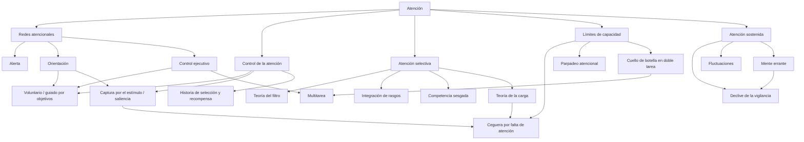

# Mapa conceptual de la atención

## Diagrama

## Relaciones clave (formato legible por máquina)

| Origen | Relación | Destino | Fuente |
|---|---|---|---|
| Orientación | se implementa en | Red dorsal (voluntaria) y red ventral (captura) | Corbetta y Shulman, 2002 |
| Control ejecutivo | regula | Conflicto y multitarea | Petersen y Posner, 2012 |
| Carga perceptiva alta | reduce | Procesamiento de distractores | Lavie et al., 2014 |
| Carga perceptiva alta | aumenta | Ceguera por falta de atención | Lavie et al., 2014 |
| Carga de memoria de trabajo alta | aumenta | Interferencia de distractores | Murphy et al., 2016 |
| Integración de rasgos | requiere | Atención focal | Treisman y Gelade, 1980 |
| Doble tarea | produce | Retraso por cuello de botella central | Pashler, 1994 |
| Tiempo en la tarea | produce | Declive de la vigilancia | Langner y Eickhoff, 2013 |
| Mente errante | se asocia con | Menor bienestar | Killingsworth y Gilbert, 2010 |
| Historia de recompensa | sesga | Selección atencional | Awh et al., 2012 |
